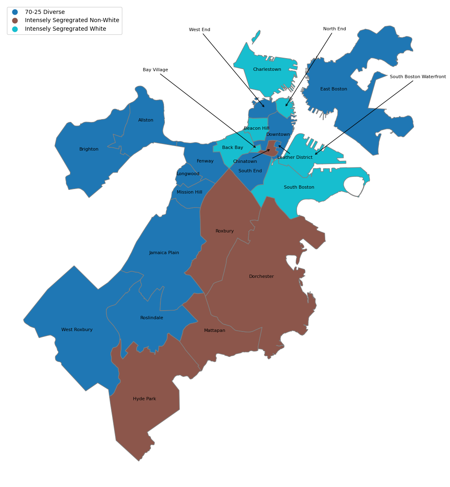

# Racial Dot Map & Diversity Index

In this repo you will find a script to create racial dot maps and diversity index scores for census block groups in Boston, MA and New York City, NY. You can use this code for an county, state or city in the US. The source dataset for this analysis is U.S. Census Bureau and American Community Survey 5 yr estimates [Table B03002 - Latino or Hispanic Origin by Race](https://data.census.gov/table?q=b03002&tid=ACSDT5Y2020.B03002).

The purpose of this analysis is to visualize and quantify residential segregation over time and to statistically test the average census block group diversity across the two major cities.

## Getting Started

Boston has recently become infamous for its racism and segregation. In a national survey commissioned by the Globe in 2017, Black people ranked Boston as the least welcoming city to people of color \[1\]. Racial inequalities have persisted in Boston despite the city’s advances in other areas like sports, higher education, biotech, and medicine. Many believe this is due to white citizens’ prejudice that erases Black communities from the city center and forces them into neighborhoods with underfunded schools, lack of transportation, and other crucial resources for economic advancement. According to the Globe, the median net worth of non-immigrant black households in the Boston area is $8 compared to $250,000 for white households. The inequities and disparities in the City of Boston are astounding, especially given the city’s reputation for liberalism and progressivism.

As a long-term resident of the city, I can attest to the striking contrast of race and socio-economic status between neighborhood blocks. Almost every neighborhood in Boston has a stereotypical long-term resident (e.g. the North End ~ Italian, South Boston/Charlestown/Neponset ~ Irish-Catholic, East Boston ~ Latino/Hispanic, Roxbury/Dorchester ~ Black, West Roxbury ~ White). These stereotypes have remained true for generations. However, Boston has more recently experienced an influx of affluent white young professionals into once lower-income neighborhoods and newly developed sections of the city like South Boston, the Seaport District, Ink Block, and along Dorchester Avenue, mainly.  

In the short time that I have resided in Brooklyn, New York, I am astounded by the level of integration within my community and those across the city. I have been aware of the residential segration in Boston for some time now but seeing the contrast in New York City and having a newly found ability to investigate spatial trends leveraging open source data, I am motivated to quantify the residential segregation in Boston and conduct a comparitive analysis to New York City. 

## Methods

### Visualization

To visualize communities across Boston I will use a racial dot map, which has been documented as the best method to visualize the racial composition of a geographical area \[5\]. 

The racial dot map is created using census block group population counts for the following eight racial groups defined by the U.S. Census Bureau \[2\],

    1. Hispanic
    2. White alone, non-Hispanic
    3. Black or African American alone, non-Hispanic
    4. American Indian and Alaska Native alone, non-Hispanic
    5. Asian alone, non-Hispanic
    6. Native Hawaiian and Other Pacific Islander alone, non-Hispanic
    7. Some Other Race alone, non-Hispanic
    8. Multiracial, non-Hispanic

in addition to the polygon geometry of the given census block groups. The output is 1 random point geometries (longitude and latitude coordinates) for each individual within their given census block group and racial demographic. This method was derived from u/kyledevyay's post in r/Python reddit thred \[4\].

### Quantifying Residential Segregation

The Shannon Diversity Index, also known as the Shannon-Wiener Index, is a well-known metric in the biology word as it has been used to measure the diversity of species in a community \[3\]. I will use this metric to measure the racial diversity of census block groups within the two major cities, Boston and New York. 

The diversity index, normally denoted as $H$, is defined as: $$H = - \sum_{} p_i \ln{p_i},$$ where $p_i$ is the proportion of the population with race $i$. The higher the diversity index, the more diverse a population is. A diversity of index of zero indicates a homogenous population with only one race group present and therefore a population with no diversity.

### Statistical Analysis

Once the Diversity Index, $H$, is calculated for each census block group across Boston and New York City, we will run a t-test to deduce whether or not the difference in average diversity index across cities are statistically significant.

I weighted the diversity index on the population density of a given census block group before running the t-test. 

### Prerequisites

This project is created using:

* Python 3.9.12
* conda 4.14.0
* matplotlib 3.5.1
* numpy 1.21.5
* pandas 1.4.2
* geopandas 0.11.1
* scipy 1.7.3
* seaborn 0.11.2
* shapely 1.8.4
* census 0.8.19
* censusdata 1.15.post1


### Installing

To run these scripts you will need to have geopandas installed. Please follow the installation directions [here](https://geopandas.org/en/stable/getting_started/install.html#creating-a-new-environment) if you do not have this package already.

I personally created a virtual environment and installed with pip, see code snipet below.

```
conda create -n geo_env
conda activate geo_env
conda config --env --add channels conda-forge
conda config --env --set channel_priority strict
conda install python=3 geopandas

pip install geopandas
```

Another dependency for these scripts is [census python package](https://github.com/datamade/census) which serves as a wrapper for the U.S. Census Buraeu's API. To install:

```
pip install census
```
 The author of this package also recommend installing library, [us](https://pypi.python.org/pypi/us), which help you figure out the [FIPS](https://en.wikipedia.org/wiki/Federal_Information_Processing_Standard_state_code) codes for many geographies. 
 
```
pip install us
```


## Outputs & Results

My initial descriptive analysis showed that:

* Out of the 25 neighborhoods in Boston, 80% have a singular race group making up the majority of it's population.  
Of the neighborhoods with majority race groups, 85% have a majority white population (68% of all Boston neighborhoods).
       
* Nearly 50% of neighborhoods are considered segregated, as seen in the figure below.


## Acknowledgments

### References

\[1\] The Spotlight Team. (2017, December 10). Boston. racism. image. reality: The spotlight team takes on our hardest question. BostonGlobe.com. Retrieved December 15, 2022, from https://apps.bostonglobe.com/spotlight/boston-racism-image-reality/series/image/ 

\[2\] Jensen, E. (2022, June 9). Measuring racial and ethnic diversity for the 2020 census. The United States Census Bureau. Retrieved December 15, 2022, from https://www.census.gov/newsroom/blogs/random-samplings/2021/08/measuring-racial-ethnic-diversity-2020-census.html 

\[3\] Zach. (2022, April 20). Shannon diversity index: Definition & Example. Statology. Retrieved December 15, 2022, from https://www.statology.org/shannon-diversity-index/ 

\[4\] R/python - I used python to make a dot density map (with 1 dot per person) for the US decennial censuses from 1990 to 2020. this is over a billion points. the result is an amazing way to visualize population and demographic changes over the last 30 years. I wanted to share the code + process I used. reddit. (n.d.). Retrieved December 15, 2022, from https://www.reddit.com/r/Python/comments/rykx3w/i_used_python_to_make_a_dot_density_map_with_1/ 

\[5\] Stepinski, T. F., & Dmowska, A. (2019). Imperfect melting pot–Analysis of changes in diversity and segregation of US urban census tracts in the period of 1990–2010. Computers, Environment and Urban Systems, 76, 101-109. Retrieved from, https://doi.org/10.1016/j.compenvurbsys.2019.04.004.

\[6\] Schneider, J., Piazza, P., Carey, A. J., and White, R. S. (2020). School integration in Massachusetts: Racial diversity and state accountability. Beyond Test Scores Project and Center for Education and Civil Rights. Retrieved from, https://cecr.ed.psu.edu/sites/default/files/Demography_Report_FINAL_7.24.20.pdf

### Data

U.S. Census Bureau. (2020). 2013-2020 American Community Survey 5-year Hispanic or Latino Origin by Race.  Retrieved from, https://data.census.gov/table?q=b03002&tid=ACSDT5Y2020.B03002
